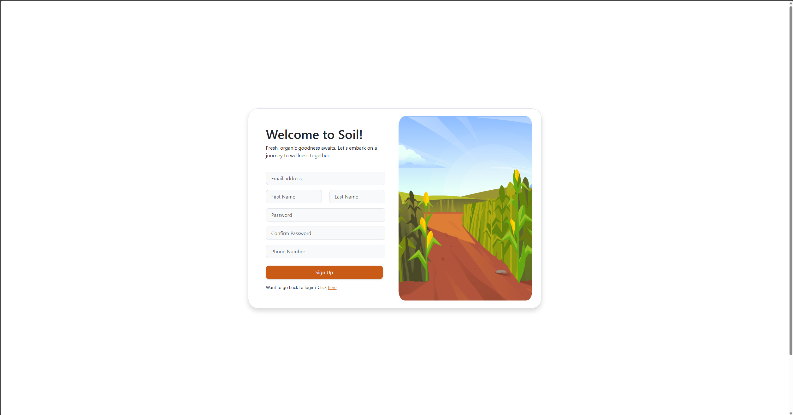
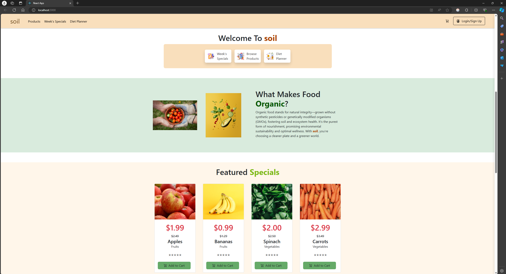
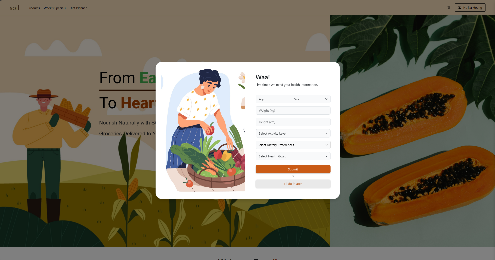
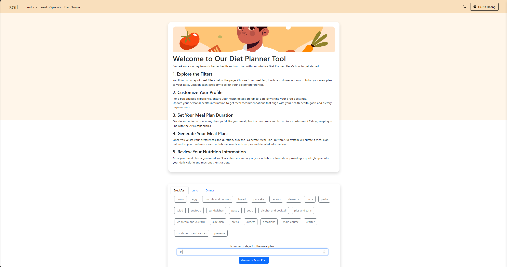
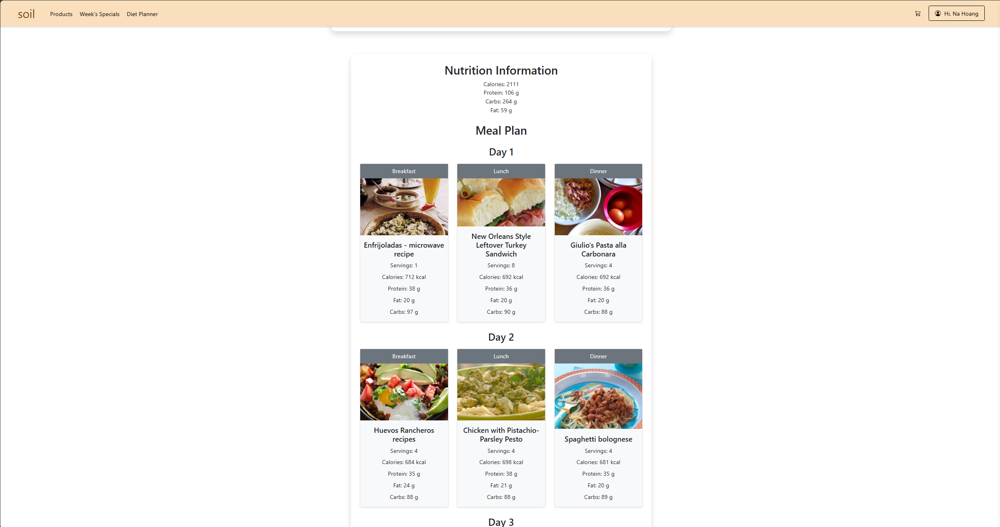
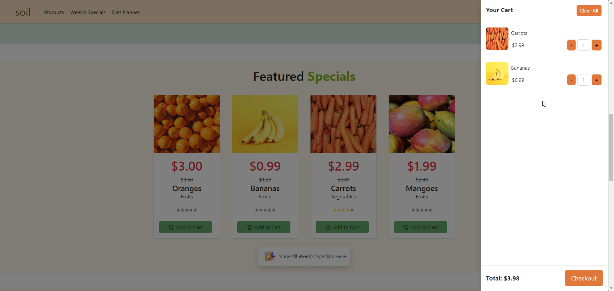
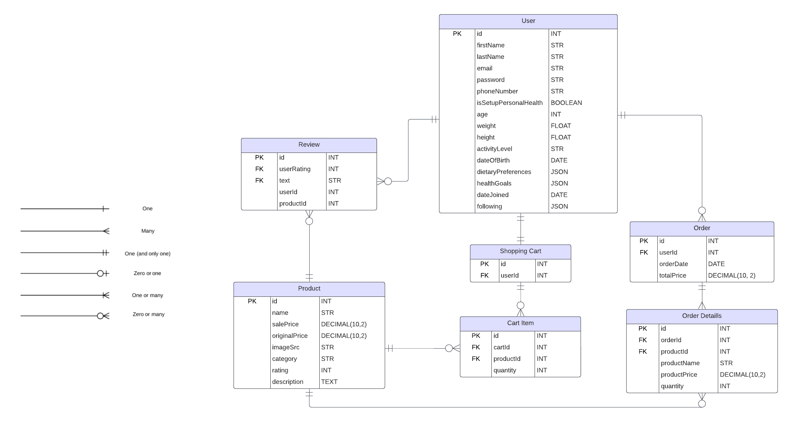

## Table of Contents
- [Installation](#installation)
- [Directory Overview](#directory-overview)
- [What's New](#whats-new)
- [Database Schema](#database-schema)
- [Unit Tests](#unit-tests)
- [Admin Dashboard](#admin-dashboard)

## Installation
To install and run the project, follow these steps (otherwise manually cd, npm install, and npm start for each server and client:

### Running Scripts
1. **On Windows:** Open powershell, navigate to the root directory of this project and run 
#### For Soil
```bash
.\start.ps1
```
#### For Admin Dashboard
```bash
.\start-admin.ps1
```

2. **On Mac/Linux:** Open Terminal, navigate to the root directory of this project, make the script executable, and run:
#### For Soil
```bash
chmod +x start.sh
./start.sh
```
#### For Admin Dashboard
```bash
chmod +x start-admin.sh
./start.sh
```

## Directory Overview
```bash
s3926822-s3906116-a2/ (root directory)
├── admin-dashboard/
├── client/ (frontend)
│       ├── node_modules/
│       ├── public/
│       ├── src/
│       └── test/ (unit tests)
│           ├── msw/
│           ├── Cart.test.jsx
│           ├── Cart2.test.jsx
│           ├── Review.test.jsx
│           └── setupTests.js
│       ├── .babelrc
│       ├── .prettierrc
│       ├── fileMock.js
│       ├── package-lock.json
│       ├── package.json
│       ├── README.md
│       └── styleMock.js
├── Other
├── server/ (backend)
│   ├── controllers/
│   ├── database/
│   ├── middlewares/
│   ├── node_modules/
│   ├── routes/
│   ├── .gitignore
│   ├── er-diagram.png (ER diagram)
│   ├── package-lock.json
│   ├── package.json
│   ├── README.md
│   └── server.js
├── ReadMe.md
├── start.ps1
└── start.sh

```

## What's New
- user details are now stored in a MySQL database
- implemented API to handle all database operations
- sign-up & sign-in forms are now **also** validated in the middle layer
- added login message 'Welcome username'
- profile & profile management features from assignment 1 are now fetched and modified via API
- all standard and special products are fetched from the database via API
- removed small-scale farming information from the site
- shopping cart operations and data are now stored in the database and implemented with API
- added quantity textbox for each added product in cart
- created several unit tests for shopping cart and review features
- users are now able to leave a review on a product page
- product cards now update their rating based off reviews
- users are now able to follow and unfollow one another from the reviews

### Note
To edit the textbox quantity, first highlight the value then enter in a new value.









- the current database uses one of ours, hence for convenience the user and password is exposed. The file can be found in server\database\config.js

## Database Schema
Database schema can be found in the server directory.


## Unit Tests
Unit tests can be found in client\test.
To run the unit tests, navigate into the client folder then run the following command:

```bash
npm test
```

## Admin Dashboard
- admin dashboard UI can be used to block and unblock a user. A login block will suffice OR you may implement a post block feature. ✅
- admin dashboard UI can be used to add/edit/delete standard and special products ✅
- all database operations via GraphQL ✅

_________________________
When the admin deletes a review, instead of permanently removing it from the database, the 'deletedByAdmin' field is set to true. On the SOIL Website, when displaying reviews, the 'deletedByAdmin' field is checked for each review. If 'deletedByAdmin' is true, the message "[**** This review has been deleted by the admin ***]" is displayed instead of the actual review content. We havent yet implemented the feature to automatically flag inappropriate comments.
__________________________

- admin dashboard UI can be used to delete a review ✅
- some automatic flags to be appear in the dashboard indicating the admin to moderate these posts ❌
- deleted reviews to show a placeholder message ✅
- all database operations via GraphQL ✅

- Most recent reviews to appear in real time on the admin dashboard ❌
- Two graphical metrics related to reviews or users ❌
